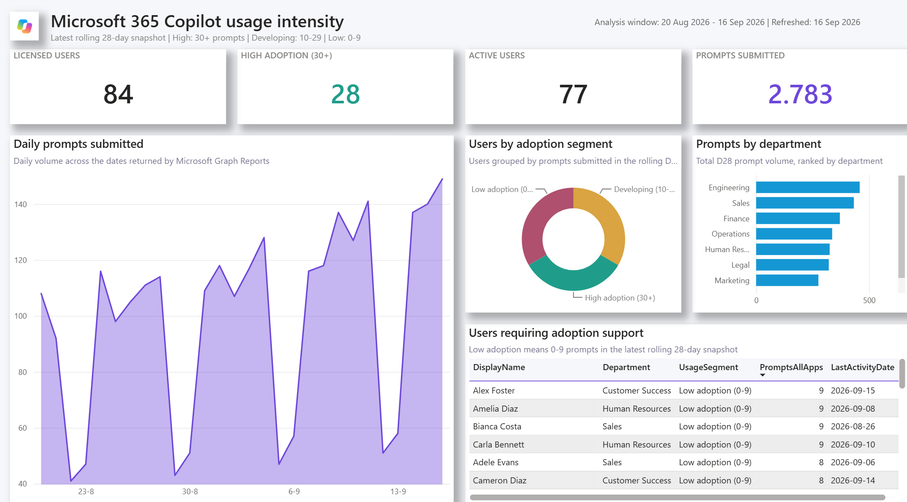
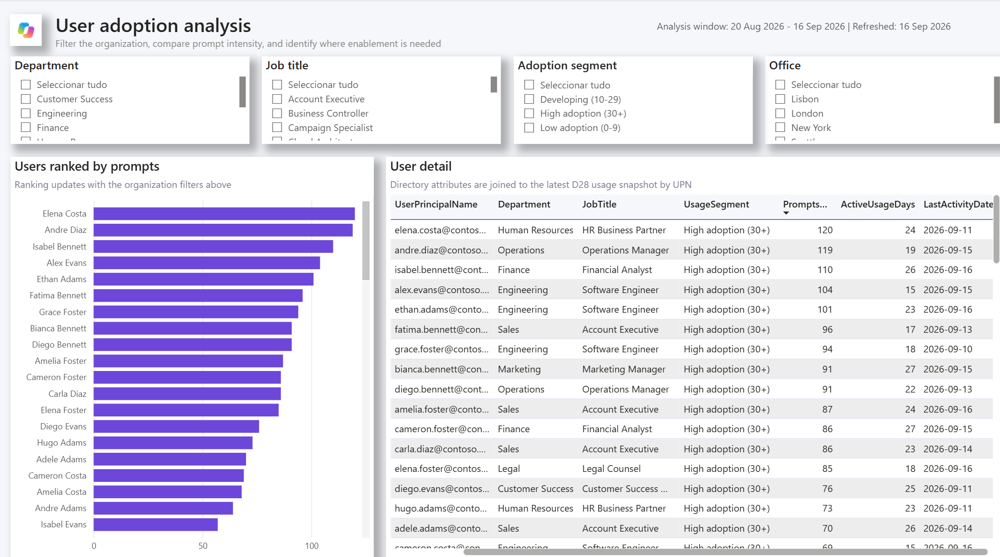

# Microsoft 365 Copilot Usage Intensity Report


An open-source Power BI solution for analyzing Microsoft 365 Copilot usage
intensity and adoption.
It exports Microsoft Graph usage data, enriches it with Microsoft Entra profile
properties, stores daily CSV snapshots in SharePoint, and presents adoption
trends in a ready-to-customize PBIP report.

## Report preview

The screenshots below use synthetic Contoso data.

### Usage overview



### User adoption analysis



Users are grouped by prompts submitted during the rolling 28-day window:

| Segment | Prompts submitted |
| --- | ---: |
| High adoption | 30 or more |
| Developing | 10 to 29 |
| Low adoption | 0 to 9 |

## What is included

- Overview and user-analysis Power BI pages
- Prompt, active-user, app, department, role, and location insights
- Current analysis-window and report-refresh labels
- Daily Microsoft 365 Copilot, trend, and Entra directory snapshots
- Two unattended deployment options with least-privilege SharePoint access

## Choose a deployment option

| Option | Best for | Runtime identity | Host requirement |
| --- | --- | --- | --- |
| [Local Scheduled Task](docs/local-deployment.md) | Evaluation and small environments | App registration with certificate | Windows user remains signed in |
| [Azure Automation](docs/azure-automation-deployment.md) | Production and cloud-only operation | System-assigned managed identity | No local machine |

Azure Automation is the recommended production option. It uses no certificate
or client secret. A daily run is sufficient because Microsoft Graph Reports is
updated approximately daily and may lag activity by up to 48 hours. Daily
snapshots also preserve history beyond the moving D28 window.

## Architecture

```text
Microsoft Graph Reports ----\
                             > PowerShell export -> SharePoint CSV snapshots
Microsoft Graph Users ------/                         |
                                                       v
                                              Power BI semantic model
```

The export identity and Power BI refresh identity are independent. The exporter
receives write access to one document library; the Power BI identity separately
needs read access to the SharePoint data.

## Runtime permissions

| Microsoft Graph application permission | Purpose |
| --- | --- |
| `Reports.Read.All` | Export Microsoft 365 Copilot usage reports |
| `User.Read.All` | Read Entra user profile properties |
| `Lists.SelectedOperations.Selected` | Address the selected SharePoint library |

`Lists.SelectedOperations.Selected` grants no access by itself. Each deployment
script also grants its runtime identity the `write` role on only the configured
document library.

## Get started

1. Choose [local deployment](docs/local-deployment.md) or
   [Azure Automation](docs/azure-automation-deployment.md).
2. Run the selected setup and complete one successful export.
3. Follow [Power BI setup](docs/power-bi-setup.md).
4. Review [security and privacy](docs/security-and-privacy.md) before production
   use.

The library will contain:

```text
UsageData/
|-- UserSnapshots/
|   `-- CopilotUsers-D28-YYYY-MM-DD.csv
|-- TrendSnapshots/
|   `-- CopilotTrend-D28-YYYY-MM-DD.csv
`-- DirectorySnapshots/
    `-- DirectoryUsers-YYYY-MM-DD.csv
```

## Privacy notice

This solution processes and displays Microsoft 365 Copilot usage data at the
individual user level, including user identity, organizational attributes,
activity dates, and prompts submitted. Access to the exported CSV files,
SharePoint library, Power BI semantic model, and report must be restricted to
authorized users with a legitimate business need.

Organizations that do not require user-level identification should enable
concealed user, group, and site names in Microsoft 365 usage reports. When
concealment is enabled, identities are pseudonymized. This improves privacy but
prevents the report from reliably joining Copilot usage data with Microsoft
Entra user profiles.

Each organization is responsible for ensuring that the collection, retention,
access, and use of this data complies with its internal policies and applicable
privacy, employment, and regulatory requirements.

## Important limitations

- The usage report covers licensed Microsoft 365 Copilot users. It does not
  include unlicensed Copilot Chat activity.
- If concealed user names are enabled in Microsoft 365 report settings, usage
  identities are pseudonymized and cannot be joined to Entra profiles.
- Microsoft APIs, permissions, and report schemas can change. Validate the
  solution after service updates.

## Documentation

- [Local Scheduled Task deployment](docs/local-deployment.md)
- [Azure Automation deployment](docs/azure-automation-deployment.md)
- [Power BI setup](docs/power-bi-setup.md)
- [Security and privacy](docs/security-and-privacy.md)
- [Contributing](CONTRIBUTING.md)
- [Security policy](SECURITY.md)

## Disclaimer

This is an independent community project and is not an official Microsoft
product. It is provided "as is", without warranty or support of any kind.
Microsoft 365, Microsoft Graph, SharePoint, and Power BI APIs, schemas,
permissions, and service behavior may change without notice.

You are responsible for validating the solution in your environment and for
meeting your organization's security, privacy, data retention, licensing, and
regulatory requirements. Use of Microsoft trademarks or product names does not
imply endorsement by or affiliation with Microsoft.

## License

Copyright 2026 The Microsoft 365 Copilot Usage Intensity Report contributors.

Licensed under the [Apache License 2.0](LICENSE).
